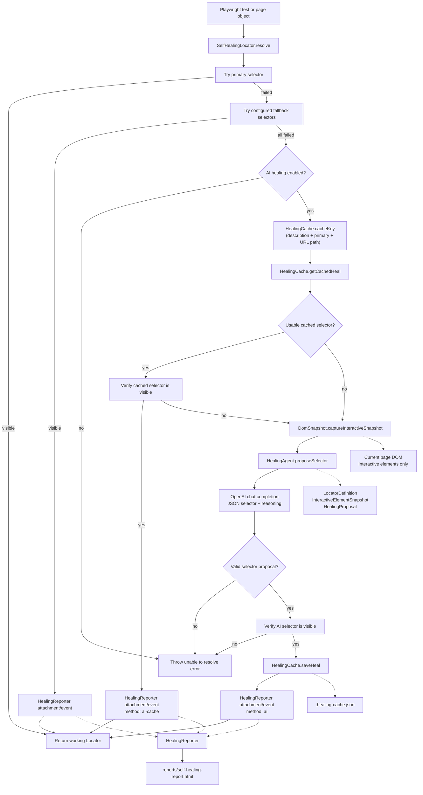

# Healing Agent Architecture

## Scope

This document covers the self-healing components in `src/agent` and the runtime path that invokes them. `SelfHealingLocator` is shown as the integration boundary because it coordinates the agent components during a test.

## Architecture Diagram

## Component Responsibilities

| Component            | Responsibility                                                                                                                                                                   | Main input/output                                            |
| -------------------- | -------------------------------------------------------------------------------------------------------------------------------------------------------------------------------- | ------------------------------------------------------------ |
| `DomSnapshot.ts`     | Extracts a compact list of current interactive DOM elements. It captures up to 150 elements and limits text to 60 characters.                                                    | Playwright `Page` -> `InteractiveElementSnapshot[]`          |
| `HealingAgent.ts`    | Sends the failed selectors, element description, page URL, and DOM snapshot to the configured OpenAI model. It accepts only strict JSON containing a CSS selector and reasoning. | Healing context -> `HealingProposal` or `null`               |
| `HealingCache.ts`    | Persists successful AI proposals in a JSON file. Cache keys use the element description, primary selector, and URL pathname.                                                     | Cache key -> `HealingCacheEntry`                             |
| `HealingReporter.ts` | Collects self-healing events attached to Playwright test results and generates an HTML report at the end of the run.                                                             | Playwright attachments -> `reports/self-healing-report.html` |
| `SelfHealingLocator` | Integration boundary outside `src/agent`. It tries selectors, invokes the agent modules, verifies proposals, and records events.                                                 | `LocatorDefinition` -> working Playwright `Locator`          |

## How One Healing Attempt Works

1. A test or page object asks `SelfHealingLocator` to resolve a `LocatorDefinition`.
2. The primary selector and configured fallbacks are tried in order.
3. If a fallback succeeds, the locator is returned and a `fallback` event is attached.
4. If all selectors fail and `ENABLE_AI_HEALING=true`, a cache key is created.
5. A cached proposal is tried first. A valid cached selector returns immediately and produces an `ai-cache` event.
6. When no usable cache entry exists, `DomSnapshot` collects candidate interactive elements from the current page.
7. `HealingAgent` sends the failed selectors and snapshot to OpenAI. The prompt requires one valid CSS selector and forbids invented attribute values.
8. The returned selector is verified with Playwright visibility checks.
9. A verified AI selector is saved by `HealingCache` and recorded as an `ai` event.
10. `HealingReporter` turns all attached events into the self-healing HTML report.
11. If no selector can be verified, the locator resolution fails with an error listing the attempted selectors.

## Runtime Configuration

| Setting                 | Default                     | Effect                                                       |
| ----------------------- | --------------------------- | ------------------------------------------------------------ |
| `ENABLE_AI_HEALING`     | `false`                     | Enables cache lookup and live AI healing when set to `true`. |
| `OPENAI_API_KEY`        | unset                       | Required for live AI proposals.                              |
| `OPENAI_MODEL`          | `gpt-4o-mini`               | Model used by `HealingAgent`.                                |
| `AI_HEALING_CACHE_FILE` | `.healing-cache.json`       | JSON file used by `HealingCache`.                            |
| `BASE_URL`              | `https://www.saucedemo.com` | Base URL used by the Playwright suite.                       |

## Event and Data Flow

The healing event attached to a test contains:

- The element description and page URL.
- Every failed selector and its first-line error.
- The healed selector.
- The method: `fallback`, `ai-cache`, or `ai`.
- Optional AI reasoning.
- The timestamp of the healing action.

The reporter reads the attachment named `self-heal:data`, groups events by test, and writes the final HTML dashboard when Playwright finishes.

## Important Boundaries

- The agent proposes selectors; it does not click, fill, or otherwise perform test actions.
- `SelfHealingLocator` remains the authority that verifies whether a proposed selector actually resolves.
- The snapshot is a structured candidate list, not raw HTML.
- Cache entries are reused only when the cached selector is not already among the failed selectors and still resolves visibly.
- Live AI healing requires both the feature flag and an OpenAI API key.
